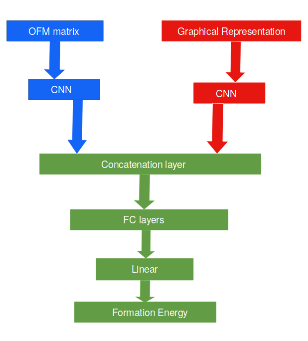

# Property prediction using OFM and crystal graph features 

This code implements a CNN model using 2 crystal descriptors - (1)   OFM (Orbital-field Matrix) and (2) crystal graph representation, that takes an arbitary crystal structure to predict material formation enthalpies.

The package provides two major functions:

- Train a CNN model with a dataset of crstal structures with their formation energies.
- Predict formation energies of new crystals with a pre-trained CNN model.

## Prerequisites

This package requires:

- [PyTorch](http://pytorch.org/)

- [scikit-learn](http://scikit-learn.org/stable/)

- [pymatgen](http://pymatgen.org/)

  ​

## Dataset 

Data is available at the this [link](https://rebrand.ly/mixture-net-dataset). Download the data and store it in separate folder named "dataset" in the root directory.

The data contains .CIF files and OFM matrix (in npz format) of 3402 crystals structures.

## Contents 

**cgcnn folder:** implements CNN model using crystals graph features

- data.py - file to load CIF data from the dataset folder
- featureModel.py - crystal graph CNN model to be used along the CNN-OFM model
- model.py - crystal graph CNN model to be run independently
- main.py - file to train the cgcnn model with the given dataset
- predict.py - file to predict the formation energy for a new crystal molecules.

**property_prediction_ofm:** implements CNN model using OFM features

- PropertyPrediction_OFM.ipynb: jupyter notebook to train the CNN model using the OFM matrix of the materials
- model.py - CNN-OFM model to be used along the cgcnn model 
- ofmMatrixCalculation.ipynb - jupyter notebook to compute the OFM matrix of crystals using the matminer library

**trained_nets folder**: Contains pre-trained model for the OFM and crystal graph features.

**dataloader.py**: file to load the combined data (CIF + OFM) to be feed to the final model

**propertyPrediction.py:** file where the combined model is implemented. This file imports the cgcnn model from the cgcnn/model.py file and CNN-OFM model from the property_prediction_ofm/model.py file.

### Model Design

The following figure illustrates our design approach for building the model.  We present an architecture where we mix the output features learned using different types of models to learn the formation energy from the two molecular representations as inputs- the OFM Matirx and Graphical-Representation of crystals.



## Code Execution

Running the cgcnn model:

```
python predict.py pre-trained/formation-energy-per-atom.pth.tar dataset/test-data
```

Running the CNN-OFM model:

```
Load the pretrained network in the PropertyPrediction_OFM.ipynb file using
toorch.load("file_path")
Run the pretrained file on the test data
```

Running the combined model:

```
Load the pretrained network in the propertyPrediction.py file using
toorch.load("file_path")
Run the pretrained file on the test data
```

## Results

This is final error that we obtained on around 10,000 test crystals - 

MAE (formation energy) - 0.041 ev/atom

The following figure variation of the MAE with the training data - 

